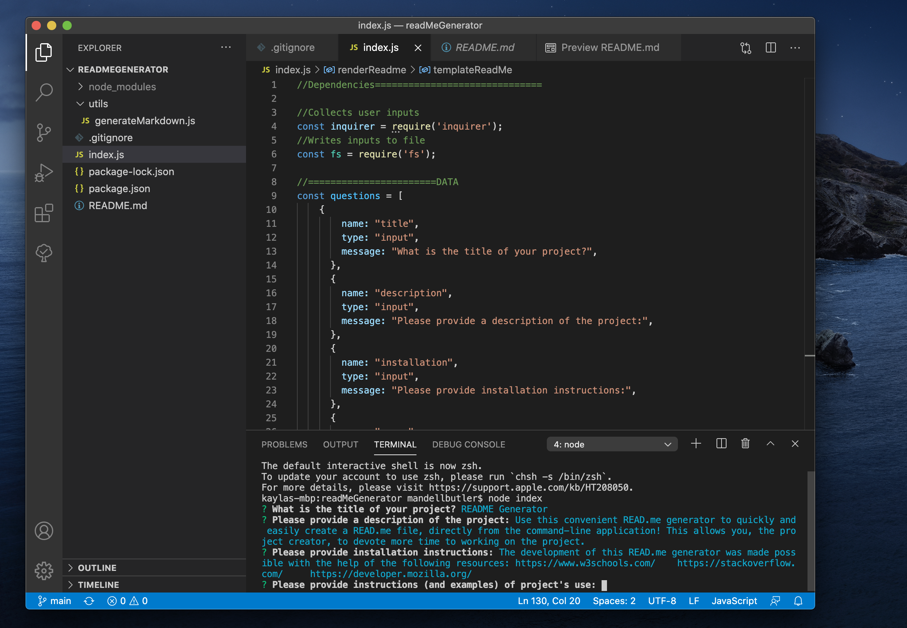

# README Generator
    
## Table of Contents
- [Description](##description)
- [Installation](##installation)
- [Usage](##usage)
- [Contributing](##contributing)
- [License](##license)
- [Tests](##test)
- [Questions](##questions)

    
## DESCRIPTION
    
Use this convenient README.md generator to quickly and easily create a README.md file, directly from the command-line application! This allows you, the project creator, to devote more time to working on the project.

    
## INSTALLATION
    
To install, simply clone the Github repository and add it to your local repo via your choice code-editing software (ie Visual Studio Code).

    
## USAGE
    
Once you have the README.md generator cloned to your local repo and opened in your code editor, simply  type ‘node index’ from your integrated terminal. You will be presented with a series of prompts. Answer the questions, provide as much information as possible about your project. (Remember, the more information you provide about the purpose, functionality, and use of your application, the better the user experience!) When you have successfully answered all of the questions, your README.md will be instantly created, saving you tons of time and energy.

Tutorial Link: https://drive.google.com/file/d/1GgI7ace5QDJkLJayA3Zt4CRronbDmcau/view

    
## CONTRIBUTING
    
The development of this README.md generator was made possible with the help of the following resources: https://www.w3schools.com/ https://stackoverflow.com/   https://developer.mozilla.org/

    
## LICENSE
    
MIT

    
## TESTS
    
N/A

    
    
## QUESTIONS

Please feel free to contact me, should you have any questions!

    
Github: https://github.com/mandellbutler

Email: mandell.butler@outlook.com

